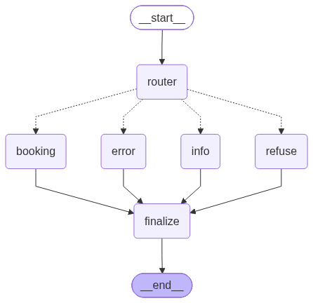

# Blue Horizon AI Concierge

**An AI hotel concierge that answers questions about the hotel and books rooms, built so
that the language model can propose a reservation but never commit one.**

[**Live demo**](#live-demo) · [**Documentation**](#documentation) · [**Results**](#results)

Built with [LangGraph](https://github.com/langchain-ai/langgraph),
[FastAPI](https://fastapi.dev), [Streamlit](https://streamlit.io), PostgreSQL, and Redis.

---

## What it does

A guest chats in natural language. A router LLM classifies each message and dispatches
it to one of two specialised sub-agents:

- **Information agent** answers questions about services, amenities, and policies using
  RAG over a Redis vector store.
- **Booking agent** searches room availability with LLM-generated, **read-only** SQL,
  and proposes bookings, cancellations, and modifications for the guest to confirm.

Anything outside those two jobs is refused.



## What makes it interesting

**The model proposes; the application decides.** The booking agent cannot write to the
database. It calls a `propose_*` tool that returns only a proposal id, never success
text. The UI renders a confirmation dialog built strictly from the proposal's stored
fields, never from the assistant's prose, and only a guest clicking **Confirm** triggers
the server-side commit. The application, not the model, authors the confirmation number.

**Safety is structural, not instructed.** That guarantee is enforced in four independent
places: two PostgreSQL roles (`bh_agent_ro` has `SELECT` on two tables and nothing
else), a `sqlglot` AST allowlist, the propose/confirm split itself, and a startup check
that refuses to boot if a trial write through the read-only connection succeeds. Double
booking is prevented by a GiST exclusion constraint that makes overlapping reservations
impossible to insert, not by a check that runs afterward.

**A workflow where an agent would be worse.** The information agent was originally built
with LangChain's `create_agent`. Its RAG tools apply user constraints as filters, so a
correct answer is often an *empty* result, which the model read as a malfunction, so it
would retry multiple times. Since the retrieval sequence is identical on every turn,
replacing the agent with a fixed LangGraph DAG removed the model's opportunity to
misinterpret emptiness at all.
[The full story](https://iannellis.github.io/Blue-Horizon-AI-Concierge/design-decisions/#the-information-agent-is-a-workflow-not-an-agent).

**Measured, with CI that can fail on it.** A 206-case multi-turn evaluation suite scores
routing, grounding, injection resistance, RAG quality, and booking outcomes, with pinned
baselines a smoke eval checks on every push. A concurrency stress test drives 50
simultaneous sessions deliberately fighting over the same 10 rooms.

## Results

Mean of three consecutive full runs over the 206-case dataset:

| | |
|---|---|
| Route accuracy | **100%** across 206 multi-turn cases |
| Consumer quality / grounding (LLM judge, 1-5) | **4.96** / **5.00** |
| RAG faithfulness / context recall | **95.7%** / **99.3%** |
| RAG context precision / answer relevancy | **90.1%** / **83.9%** |
| Booking tool-call success rate | **100%** |
| Stress test: 250 concurrent booking ops | **0 errors** |
| Latency p50 (info / booking) | **5.0 s** / **5.5 s** |

The stress test reveals no double-bookings, which is enforced by the database schema.

Full metric tables, per-run ranges, methodology, and what grades what:
[Evaluation](https://iannellis.github.io/Blue-Horizon-AI-Concierge/evaluation/).

## Live demo

A deployed instance runs on HuggingFace Spaces, gated by Google OAuth. Recruiters and
hiring managers can request access to be added to the allowed-users list.

Once access is granted, the agent is at
**[iellis02-blue-horizon.hf.space](https://iellis02-blue-horizon.hf.space)**. This exact
URL must be used; Google login will not work from any other origin.

If the Space has gone to sleep and returns a 500, restart it from
[huggingface.co/spaces/iellis02/blue-horizon](https://huggingface.co/spaces/iellis02/blue-horizon).

## Documentation

Full documentation is at
**[iannellis.github.io/Blue-Horizon-AI-Concierge](https://iannellis.github.io/Blue-Horizon-AI-Concierge/)**.

- **[Architecture](https://iannellis.github.io/Blue-Horizon-AI-Concierge/architecture/)**
  covers the orchestration graph, the
  [information agent](https://iannellis.github.io/Blue-Horizon-AI-Concierge/architecture/information-agent/),
  and the
  [booking agent](https://iannellis.github.io/Blue-Horizon-AI-Concierge/architecture/booking-agent/).
- **[Design Goals and Decisions](https://iannellis.github.io/Blue-Horizon-AI-Concierge/design-decisions/)**
  records what changed direction and why, including the failures that prompted each
  change.
- **[Running Locally](https://iannellis.github.io/Blue-Horizon-AI-Concierge/guides/running-locally/)**
  and
  **[Configuration](https://iannellis.github.io/Blue-Horizon-AI-Concierge/guides/configuration/)**
  cover setup, data loading, and every tunable and environment variable.
- **[API Reference](https://iannellis.github.io/Blue-Horizon-AI-Concierge/api/)**
  documents the endpoints, the SSE event protocol, and the propose/confirm contract.
- **[Evaluation](https://iannellis.github.io/Blue-Horizon-AI-Concierge/evaluation/)**
  has the results, the
  [harness](https://iannellis.github.io/Blue-Horizon-AI-Concierge/evaluation/harness/),
  and the
  [stress test](https://iannellis.github.io/Blue-Horizon-AI-Concierge/evaluation/stress-test/).
- **[Code Reference](https://iannellis.github.io/Blue-Horizon-AI-Concierge/reference/)**
  is generated from the source docstrings.

## Quick start

Requires Python 3.13, Redis, and a PostgreSQL database with the `bh_agent_rw` and
`bh_agent_ro` roles created.

```bash
uv sync --group ui

# Load the vector store and the relational data
python -m blue_horizon.load_data.information_redis
python -m blue_horizon.load_data.booking_pgsql

# Run both processes
fastapi run blue_horizon/api/app.py --port 8000
streamlit run ui/app.py
```

See
[Running Locally](https://iannellis.github.io/Blue-Horizon-AI-Concierge/guides/running-locally/)
for the environment variables and the role grant step.

## License

[BSD 3-Clause](LICENSE)
