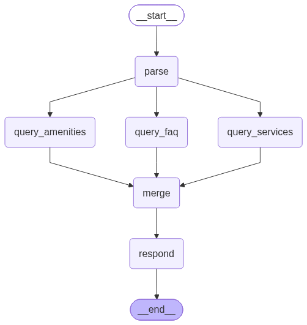

# Information agent



The information agent answers questions about hotel services, amenities, and policies
using RAG over three Redis vector indices. It is a **fixed workflow, not a tool-calling
agent**: the graph below runs the same six nodes in the same order on every info-routed
turn, with no loop and no LLM decision about which retriever to call.

## Pipeline

```
START -> parse -> +-- query_faq -------+
                  |                    |
                  +-- query_amenities -+-> merge -> respond -> END
                  |                    |
                  +-- query_services --+
```

1. A **parse** node extracts one or more sub-queries from the user message, along with
   any constraints: price bounds, duration bounds, booking requirements, and notice
   time.
2. Three **retrieval** nodes run in parallel against separate Redis vector indices
   (FAQ, amenities, services).
3. A **merge** node merges and deduplicates the retrieved context.
4. A **respond** node generates the final answer from the merged context.

Embeddings are produced with OpenAI (`text-embedding-3-small`) and stored in Redis via
LlamaIndex. Retrieval is capped by `[info.retrieval].top_k` per source and
`max_context_items` overall, so a question that parses into many sub-queries cannot grow
the context without bound.

## Why a workflow instead of an agent

The information agent was originally built with LangChain's `create_agent`, giving the
LLM a set of retrieval tools and letting it decide which to call.

That failed in a specific and instructive way. The retrieval tools apply the parsed
constraints as **filters** on the vector search: a query for a spa treatment under $150
with at most four hours' notice filters the services index down accordingly. When
nothing matches those filters, the tool correctly returns an empty result. But an empty
tool result reads to the LLM as a *failure*, not as an answer. The model would retry the
same tool, loosen the filters on its own initiative, apologise for a technical problem,
or fabricate a plausible-sounding service to fill the gap. The correct response - "we
have no spa treatment matching those constraints" - was the one outcome it would not
reliably produce.

The fix was to notice that the process is the same every time. There is no genuine
decision for the model to make about which indices to search, because the answer is
always "all three, in parallel, with the parsed filters applied." Once that is a fixed
graph rather than a tool-calling loop, an empty retrieval is just an empty slice of the
merged context. The respond node sees the context it sees and answers from it. Nothing
in the control flow interprets emptiness as an error, because nothing in the control
flow is deciding anything.

This also removed a class of latency variance. A tool-calling agent takes an
unpredictable number of LLM round trips; this graph takes exactly two (parse and
respond) plus three parallel vector searches.

!!! note "The general lesson"
    Reach for an agent when the model genuinely needs to choose. When the sequence of
    steps is knowable in advance, a workflow is cheaper, faster, and - because it
    removes the model's opportunity to misread a correct-but-empty result as a
    malfunction - more reliable. See
    [Design Goals and Decisions](../design-decisions.md#the-information-agent-is-a-workflow-not-an-agent).

## Filters and the no-match path

Constraint extraction is driven by
[`system_prompts/information_parser.txt`](https://github.com/iannellis/Blue-Horizon-AI-Concierge/blob/main/blue_horizon/system_prompts/information_parser.txt).
Getting the parser to leave filters unset when the user did not actually constrain
anything took several rounds of prompt work: an over-eager parser that invents a
`max_price` from a passing mention of budget filters out valid results. The eval
suite's `info_expected_filters_pass_rate` metric exists to hold that line, comparing the
parser's extracted filters against hand-labelled expectations per turn.

The no-match response was separately softened. An early version replied with a blunt
"I could not find exactly what you requested", which is accurate but unhelpful; the
current prompt asks for a response that states what was not found and offers what is
available nearby.

## Merge, formerly rerank

The merge node was originally named `rerank`, which overstated what it does. It merges
the three sources' results, deduplicates them, and applies the context ceiling. It does
not run a cross-encoder or any second-stage relevance model. The rename was cosmetic but
worth doing: a node named `rerank` invites a reader to assume a reranking model is in
the retrieval path when none is.
